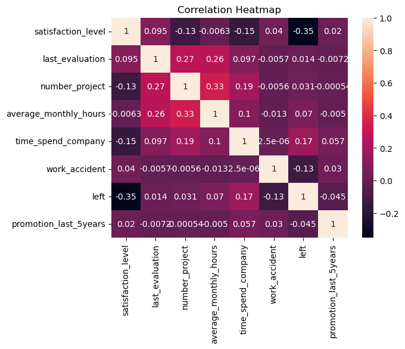
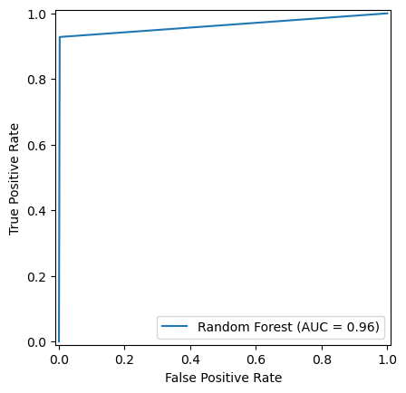

# Predicting Employee Turnover at Salifort Motors

## Project Overview
This project aims to predict employee turnover at Salifort Motors using a dataset containing various factors influencing employee retention. The goal is to identify patterns and relationships between these factors and employee turnover, thereby providing actionable insights to improve employee retention and reduce costs associated with hiring and training new employees.

## Business Understanding
The stakeholders involved in this project are the management team at Salifort Motors, who seek to retain employees to maintain productivity and reduce recruitment costs. The business problem addressed is the high turnover rate among employees, which negatively impacts the company's bottom line and employee morale. An article on LinkedIn titled 'How Can You Predict Employee Turnover Using Machine Learning Algorithms?' provided substantial guidance for this project. 

## Data Understanding
The dataset used in this project contains information on various factors influencing employee retention, including work hours, satisfaction levels, performance review scores, and years in the company. The data covers a timeframe of the past five years, with no known limitations. Visualizations of the exploratory data analysis (EDA) are included to illustrate the distribution and relationships between variables.

## Modeling and Evaluation
Two models were developed and evaluated: a Logistic Regression model and a Random Forest model. The Random Forest model showed superior performance with an Area Under the Curve (AUC) of 96%, indicating a high degree of accuracy in predicting employee turnover. Key evaluation metrics include Accuracy (98.61%), Precision (98.75%), Recall (92.80%), and F1 Score (95.68%).

## Conclusion
The insights gained from the model suggest that job satisfaction, number of projects, work hours, performance review scores, and years in the company are significant predictors of employee turnover. Promotions have the least impact on retention rates. The model's high performance indicates that it can be a valuable tool for guiding retention strategies.

---

